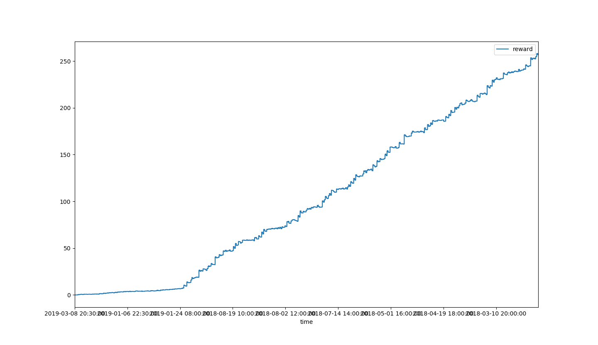

# DeepCrypto
## A hyperOpt framework to train deep network for trading in crypto assets

#### Introduction
This flesh of the project is in the folder, ```pgportfolio```. However, to start off the project, you also need to supply data in the ```data_base``` folder. To start off the hyper-parameter tuning, simply run ```python main.py --mode=hyperopt```. 

#### Asynchronous Hyperparameter Tuning
In the future, asynchronous hyperopt may be enabled by softlinking the package to the folder visible by the site package of HyperOpt. The asynchronous training might ask you to initiate a mongo database and several workers as provided in the package. 

#### Data Feeding
The data should be fed in the format of parquet.gzip, which is efficient in terms of space and speed of reading/writing. The path to a specific date should look something like ```./data_base/data/2019/20190103.parquet.gzip```. You can download the data from Poloniex. There's a function in ```data_manager``` that helps you write panel data in pandas to the path described above. The functionality will be formalized in the future as a part of those provided by the ```main.py```.

#### Performance
A preliminary training of the agents generate agent_0003 as the best performer. The pnl plot looks like

